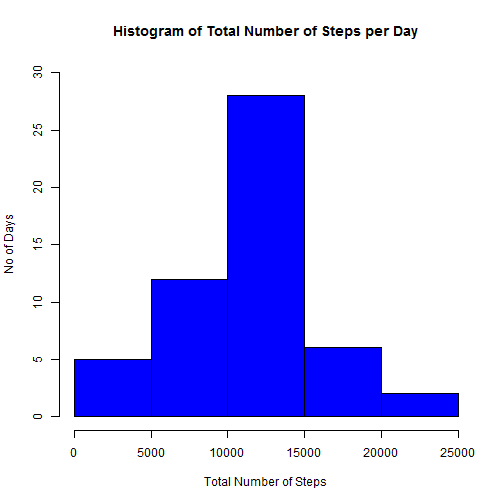
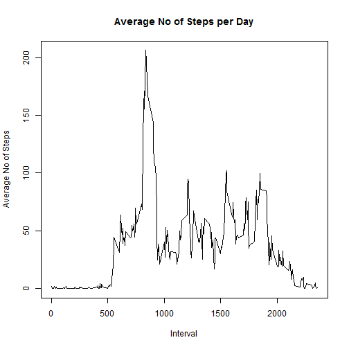
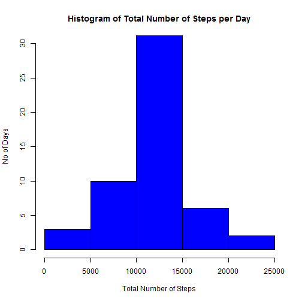
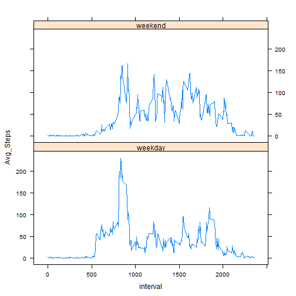

Data Processing
---

* Loading libraries and checking the data

- No of rows should equal 17,568


```r
library(lubridate)
library(dplyr)

activity <- read.csv("activity.csv")
head(activity)
```

```
##   steps       date interval
## 1    NA 2012-10-01        0
## 2    NA 2012-10-01        5
## 3    NA 2012-10-01       10
## 4    NA 2012-10-01       15
## 5    NA 2012-10-01       20
## 6    NA 2012-10-01       25
```

```r
tail(activity)
```

```
##       steps       date interval
## 17563    NA 2012-11-30     2330
## 17564    NA 2012-11-30     2335
## 17565    NA 2012-11-30     2340
## 17566    NA 2012-11-30     2345
## 17567    NA 2012-11-30     2350
## 17568    NA 2012-11-30     2355
```

```r
summary(activity)
```

```
##      steps                date          interval     
##  Min.   :  0.00   2012-10-01:  288   Min.   :   0.0  
##  1st Qu.:  0.00   2012-10-02:  288   1st Qu.: 588.8  
##  Median :  0.00   2012-10-03:  288   Median :1177.5  
##  Mean   : 37.38   2012-10-04:  288   Mean   :1177.5  
##  3rd Qu.: 12.00   2012-10-05:  288   3rd Qu.:1766.2  
##  Max.   :806.00   2012-10-06:  288   Max.   :2355.0  
##  NA's   :2304     (Other)   :15840
```

```r
print(paste("Number of rows",nrow(activity)))
```

```
## [1] "Number of rows 17568"
```

```r
str(activity)
```

```
## 'data.frame':	17568 obs. of  3 variables:
##  $ steps   : int  NA NA NA NA NA NA NA NA NA NA ...
##  $ date    : Factor w/ 61 levels "2012-10-01","2012-10-02",..: 1 1 1 1 1 1 1 1 1 1 ...
##  $ interval: int  0 5 10 15 20 25 30 35 40 45 ...
```


Preprocessing the data : converting dates column into dates


```r
activity$date <- ymd(activity$date)
str(activity)
```

```
## 'data.frame':	17568 obs. of  3 variables:
##  $ steps   : int  NA NA NA NA NA NA NA NA NA NA ...
##  $ date    : POSIXct, format: "2012-10-01" "2012-10-01" ...
##  $ interval: int  0 5 10 15 20 25 30 35 40 45 ...
```

Analysis Results : Part 1
---
Calculate the mean and median total number of steps taken per day (ignoring missing values)?


```r
Tab1 <- filter(activity, !is.na(activity$steps)) %>% group_by(date) %>% summarize(total_step=sum(steps, na.rm=TRUE))
print(paste("Mean: " , mean(Tab1$total_step)))
```

```
## [1] "Mean:  10766.1886792453"
```

```r
print(paste("Median: ", median(Tab1$total_step)))
```

```
## [1] "Median:  10765"
```

Histogram of the Total Number of Steps taken each day


```r
hist(Tab1$total_step, col="blue", main="Histogram of Total Number of Steps per Day", xlab = "Total Number of Steps", ylab="No of Days",ylim=c(0,30))
```

 

Plotting the average daily activity pattern for each 5-minute interval


```r
Tab2 <- filter(activity, !is.na(activity$steps)) %>% group_by(interval) %>% summarize(Avg_Steps = mean(steps))
with(Tab2, plot(interval, Avg_Steps, type = "l", xlab = "Interval", ylab = "Average No of Steps", main = "Average No of Steps per Day"))
```

 

Which 5-minute interval, on average across all the days in the dataset, contains the maximum number of steps?


```r
maxstp<-max(Tab2$Avg_Steps)
A <- filter(Tab2, Avg_Steps == maxstp)
print(paste("5 minute interval with the maximum number of steps", A[,1]))
```

```
## [1] "5 minute interval with the maximum number of steps 835"
```

Imputing missing values
---

#### Calculating the number of days/intervals where there are missing values (coded as NA ) since the presence of missing days may introduce bias into some calculations or summaries of the data.

- Calculating the total number of missing values in the dataset (i.e. the total number of rows with  NA s)


```r
print(paste("Number of rows with NAs = ", sum(is.na(activity$steps))))
```

```
## [1] "Number of rows with NAs =  2304"
```

- Imputing the missing values by using the daily Average Steps for the missing values.

- Select Non-missing obs into a object - label as Measured


```r
Tab2_Act <- filter(activity, !is.na(activity$steps))
Tab2_Act$partition <- 'Measured'
```

- Select Missing obs into a object - label as Imputed


```r
Tab2_NA <- filter(activity, is.na(activity$steps))
Tab2_NA$partition <- 'Imputed'
```
- Merge the Interval Averages onto the NA dataset and create a new dataset with both the measured and imputed values


```r
Tab2_ordered <- merge(Tab2_NA, Tab2, by.x = "interval", by.y = "interval")
Tab2_ordered$steps <- Tab2_ordered$Avg_Steps

Tab3 <- rbind(Tab2_Act[,1:4], Tab2_ordered[,1:4])
```

- Check the rows after the merge and appending


```r
print(paste("Number of rows = ",nrow(Tab3)))
```

```
## [1] "Number of rows =  17568"
```

- Calculating the Mean and Median of this dataset.
- Histogram of the Total Number of Steps each Day using the dataset including the Imputed values.


```r
Tab4 <- filter(Tab3, !is.na(activity$steps)) %>% group_by(date) %>% summarize(total_step=sum(steps, na.rm=TRUE))
print(paste("Mean: " , mean(Tab4$total_step)))
```

```
## [1] "Mean:  11086.1303284416"
```

```r
print(paste("Median: ", median(Tab4$total_step)))
```

```
## [1] "Median:  10553.8773584906"
```

```r
hist(Tab4$total_step, col="blue", main="Histogram of Total Number of Steps per Day", xlab = "Total Number of Steps", ylab="No of Days",ylim=c(0,30))
```

 

```r
print(paste("Difference in Mean (Measured only - incl Imputed) = ", mean(Tab4$total_step) - mean(Tab1$total_step)))
```

```
## [1] "Difference in Mean (Measured only - incl Imputed) =  319.941649196368"
```

```r
print(paste("Difference in Median (Measured only - incl Imputed) = ", median(Tab4$total_step) - median(Tab1$total_step)))
```

```
## [1] "Difference in Median (Measured only - incl Imputed) =  -211.122641509435"
```

* Differences in the mean and median values between the dataset including the imputed values and the measured dataset is 320 and -211 respectively. The impact of imputing missing data is that the mean and median values can change away from those of the 'measured' dataset and this could possibly introduce unexpected bias into the results.

Analysis Results : Part 2 - Activity between weekdays and weekends.
---

For this part of the analysis the dataset including the imputed values was used.

- Including a new factor variable with two levels -- "weekday" and "weekend" which indicates whether a given date is a weekday or weekend day.

```r
Tab3$weekdays <- weekdays(Tab3$date)
Tab3$TypeofDay <- with(Tab3,ifelse(Tab3$weekdays %in% c("Saturday","Sunday"),"weekend","weekday"))
```

- Comparing the average number of steps taken over week or weekend days by using a time series plot of the 5-minute interval (x-axis). 


```r
Tab5 <- Tab3 %>% group_by(TypeofDay, interval) %>% summarize(Avg_Steps = mean(steps))

library(lattice)
xyplot(Avg_Steps ~ interval | TypeofDay, data = Tab5, layout = c(1,2), type = 'l')
```

 

* On average the weekdays has a higher step rate up to approx 9:30 after which there is a fairly constant average step rate up to 20:00. On weekends there is less variation in the average step rate for most of the day. 

